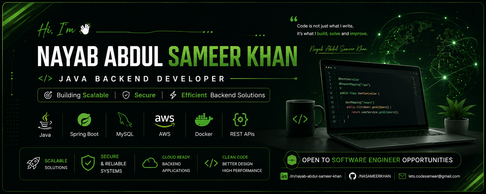

  

<h1 align="center">Hi 👋, I'm Nayab Abdul Sameer Khan</h1>

<h3 align="center">A Passionate Java Backend Developer from India 🇮🇳</h3>

---

## 👨‍💻 About Me

- 🎓 B.Tech CSE (Data Science)
- 💻 Passionate about Backend Development
- 🌱 Currently learning **Spring Boot, AWS & Docker**
- 🚀 Building real-world Java Projects
- 🎯 Goal: Software Engineer

---
## 🛠️ Tech Stack

<table align="center">
<tr>
<td align="center">
 
<b>Java</b>
</td>

<td align="center">
 
<b>Spring Boot</b>
</td>

<td align="center">
 
<b>MySQL</b>
</td>

<td align="center">
 
<b>REST API</b>
</td>

<td align="center">
 
<b>Git</b>
</td>

<td align="center">
 
<b>GitHub</b>
</td>

<td align="center">
 
<b>Maven</b>
</td>

<td align="center">
 
<b>Postman</b>
</td>

<td align="center">
 
<b>AWS</b>
</td>

<td align="center">
 
<b>Docker</b>
</td>

<td align="center">
 
<b>IntelliJ</b>
</td>

<td align="center">
 
<b>VS Code</b>
</td>

<td align="center">
 
<b>HTML5</b>
</td>

<td align="center">
 
<b>CSS3</b>
</td>

<td align="center">
 
<b>JavaScript</b>
</td>

</tr>
</table>

## 📊 GitHub Statistics

## 📈 Contribution Graph

  

# 🚀 Featured Projects

<table>
<tr>

<td width="33%" valign="top">

### 💳 PaySphere

**Secure Exam Fee & Hall Ticket Management System**

A full-stack web application to manage exam fee payments, generate hall tickets, and maintain semester-wise payment records.

**🛠️ Tech Stack**

`Java` `Spring Boot` `MySQL` `HTML` `CSS` `JavaScript`

 

</td>

<td width="33%" valign="top">

### 🌐 Portfolio

**Personal Developer Portfolio**

A responsive portfolio website showcasing my skills, projects, achievements and contact information.

**🛠️ Tech Stack**

`HTML5` `CSS3` `JavaScript`

 

</td>

<td width="33%" valign="top">

### 📝 Quiz Application

**Online Quiz Management System**

A quiz platform featuring authentication, timer, automatic score calculation and leaderboard.

**🛠️ Tech Stack**

`Java` `Spring Boot` `MySQL`

 

</td>

</tr>
</table>
## 🚀 Currently Learning

📬 Connect With Me

## 🏅 Certifications

<h1 align="center">🏆 Professional Certifications</h1>

A collection of my certifications, internships, hackathons, and international achievements demonstrating my continuous learning and professional growth.

---

# 🎓 NPTEL Certifications

| Certificate | View |
|:------------|:----:|
| ☕ Programming in Java | 📄 [Open](https://github.com/NASAMEERKHAN/Professional-Certifications/blob/main/Program%20in%20java.pdf) |
| 🌐 Introduction to IoT | 📄 [Open](https://github.com/NASAMEERKHAN/Professional-Certifications/blob/main/IoT.pdf) |

---

# 💻 SkillDzire Internships

| Certificate | View |
|:------------|:----:|
| ☕ Java Full Stack Internship | 📄 [Open](https://github.com/NASAMEERKHAN/Professional-Certifications/blob/main/FULL%20stack%20java.pdf) |
| 🐍 Python Internship | 📄 [Open](https://github.com/NASAMEERKHAN/Professional-Certifications/blob/main/Python%20skilldzire.pdf) |

---

# 🎓 Coursera Professional Certificates

| Certificate | View |
|:------------|:----:|
| 🤖 IBM Professional Certificate | 📄 [Open](https://github.com/NASAMEERKHAN/Professional-Certifications/blob/main/IBM.pdf) |
| 📊 Google Professional Certificate | 📄 [Open](https://github.com/NASAMEERKHAN/Professional-Certifications/blob/main/Google.pdf) |

---

# 🏆 Competitions & International Programs

| Achievement | View |
|:------------|:----:|
| 🏅 Smart India Hackathon (SIH) | 📄 [Open](https://github.com/NASAMEERKHAN/Professional-Certifications/blob/main/SIH.pdf) |
| 🌏 Asian Institute of Technology (Thailand) | 📄 [Open](https://github.com/NASAMEERKHAN/Professional-Certifications/blob/main/AIT.pdf) |

---

## 🌟 Skills Earned

---

⭐ Thank you for visiting my Certifications Repository!

